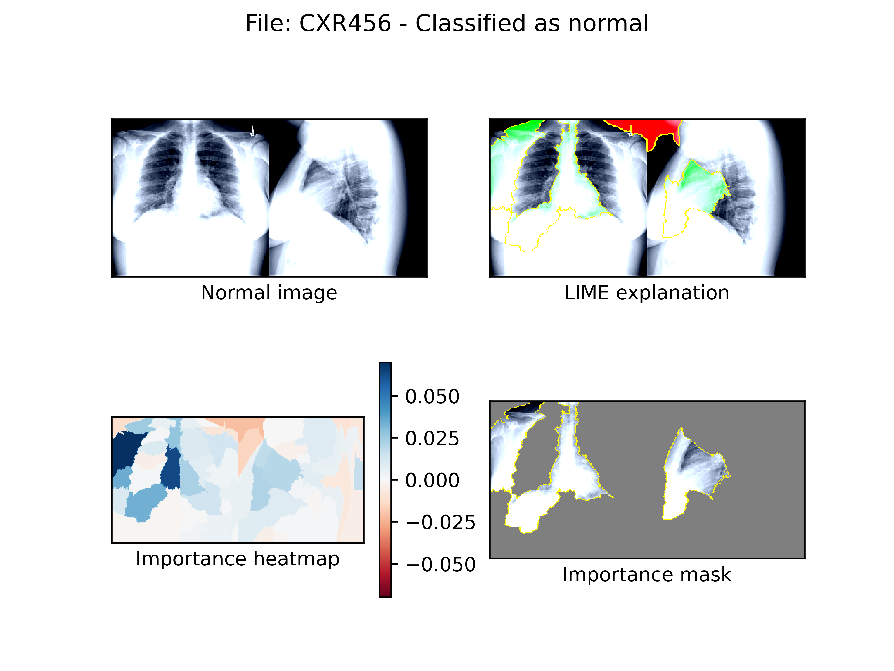
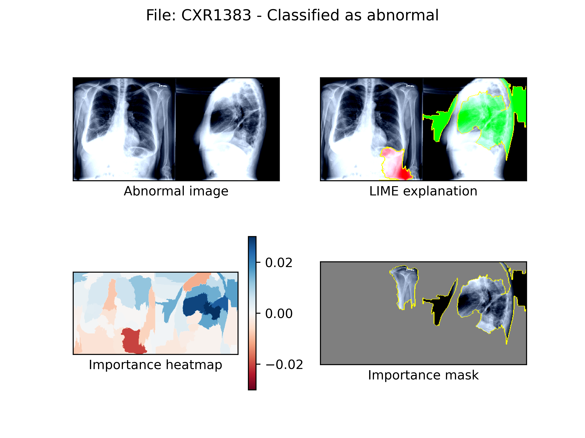

# RTEX@E

Explainable AI for image classification in radiology.


This repository is based on the work done in [this article](https://academic.oup.com/jamia/article/28/8/1651/6242739).

## How to run it

1. Install the requirements in `requirements.txt`
    ```
   pip install -r requirements.txt
   ```
2. Run the `explainability.py` script
    ```
   python explainability.py
   ```
   
## Output
Based on the settings selected in the `explainability.py` script the generated plots will appear in the `plots` folder

## Examples

### Normal images



### Abnormal images



### Tags

